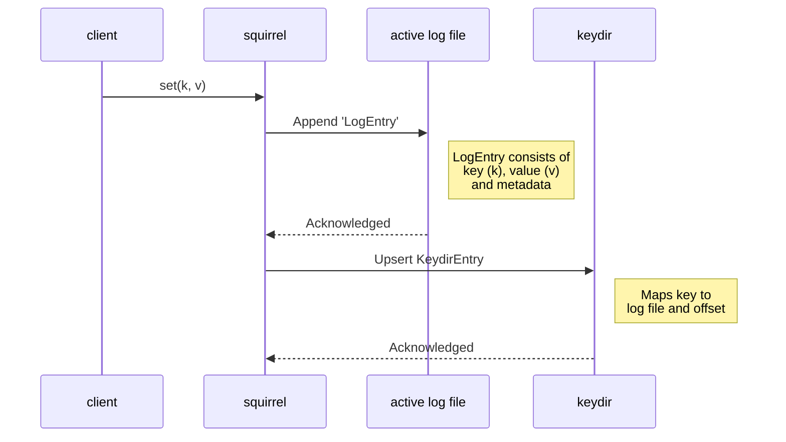

# squirrel

_As in "[to squirrel away][squirrel-away]"._

A (replicated) key-value store which uses a simple implementation of [bitcask](https://github.com/basho/bitcask/blob/develop/doc/bitcask-intro.pdf) as the underlying storage mechanism.

## How it works

This follows a simple structure and exposes a very common API surface: `set(k,v)`, `get(k)`, and `remove(k)`.

> [!NOTE]
> For now, both keys and values are restricted to `String` types.

## Notes

This was initially built through my implementation of the PingCAP talent plan course for building a key-value store in Rust:

- [Course](https://github.com/pingcap/talent-plan/tree/master/courses/rust#the-goal-of-this-course)
- [Lesson plan](https://github.com/pingcap/talent-plan/blob/master/courses/rust/docs/lesson-plan.md#pna-rust-lesson-plan)

And has since grown into my own toy project.

[squirrel-away]: https://dictionary.cambridge.org/dictionary/english/squirrel-away
