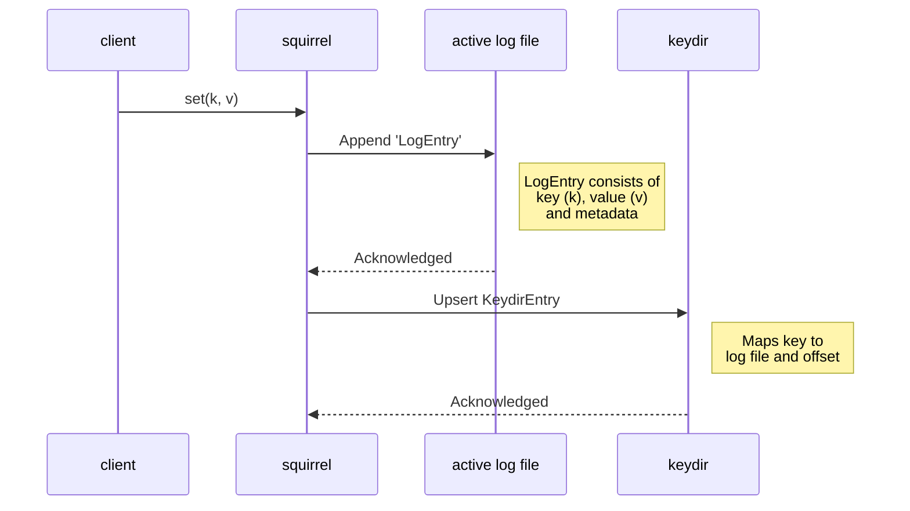

# squirrel

_As in "[to squirrel away][squirrel-away]"._

A (replicated) persistent key-value store which uses a simple implementation of [bitcask](https://github.com/basho/bitcask/blob/develop/doc/bitcask-intro.pdf) as the underlying storage mechanism.

## How it works

This follows a simple structure and exposes a very common API surface: `set(k,v)`, `get(k)`, and `remove(k)`.

### Get

A `get(k)` operation will read from the running store via its `keydir`. The value
**must** exist here in order for it to be returned[^1], as the `keydir` contains a
mapping of all known values and their respective offsets in the active or commpacted
log files.

[^1]: When a call to `open` is done, the directory is scanned for any log files,
which means that in the event of a crash or restart the `keydir` is always rebuilt
to its prior state.

If a key exists its containing log file is opened, the offset is seeked, and the
entry deserialised for return.

In the event of a `None` value, this signifies either a tombstone value (from prior removal)
or a key which has never existed. In either case, the value does not exist in the
`keydir` so no value is returned.

### Set

> [!NOTE]
> For now, both keys and values are restricted to `String` types.

### Remove

A call to `remove(k)` is similar to `get(k)`, except a tombstone value, represented
by `None`, is appended to the active log file and updated in the `keydir`.

The tombstone value signifies that the entry should be dropped on the next compaction
cycle[^2]. This means that the value will no longer be present afterwards.

[^2]: Compaction is not a background job, it is a simple check over `MAX_LOG_FILE_SIZE`
after either a `set` or `remove` operation, as these cause an append to the active log file.

Attempting to remove a key which does not exist will result in an error.

## Notes

This was initially built through my implementation of the PingCAP talent plan course for building a key-value store in Rust:

- [Course](https://github.com/pingcap/talent-plan/tree/master/courses/rust#the-goal-of-this-course)
- [Lesson plan](https://github.com/pingcap/talent-plan/blob/master/courses/rust/docs/lesson-plan.md#pna-rust-lesson-plan)

And has since grown into my own toy project.

[squirrel-away]: https://dictionary.cambridge.org/dictionary/english/squirrel-away
